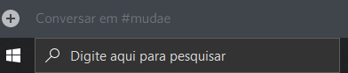

# Sequence Ban
 
Made to ban a previously defined list of ids, controlling the mouse and keyboard to send the commands

## How to use:
**First install all the requirements**
~~~shell
>> pip install -r requirements.txt
~~~

**Save the ids in the list named** `ids.txt`, **all the ids must be a integer bigger than** `100000000000000000` like:
~~~
512227974893010954
235088799074484224
432610292342587392
297153970613387264
~~~

**So start the script** `listBan.py`

**------------ WARN ------------**

**The pyautogui module requires the position in the screen that you can locale the discord text box, by default the position is x50 y962. For this position works (and considering that your monitor size is 1280 x 1024), you have to move the discord window for this place:**

